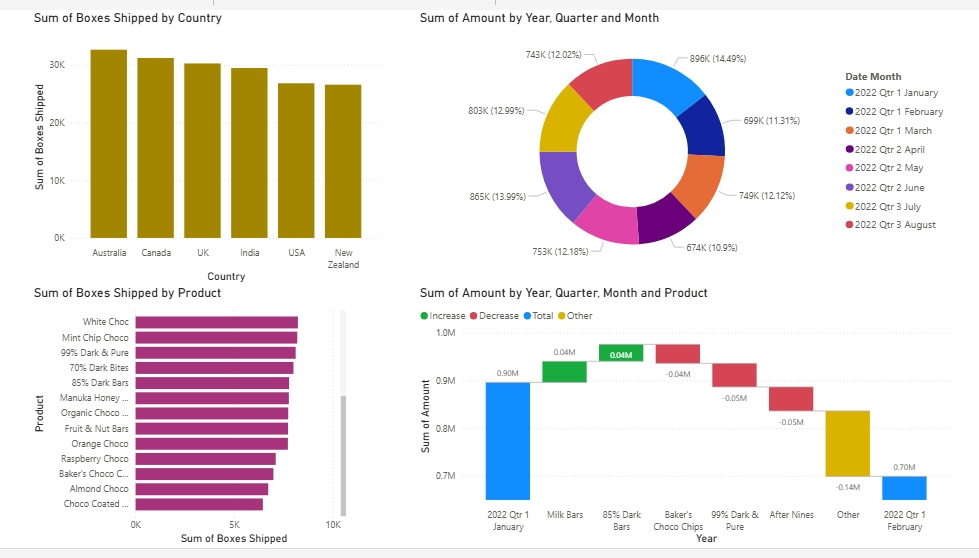
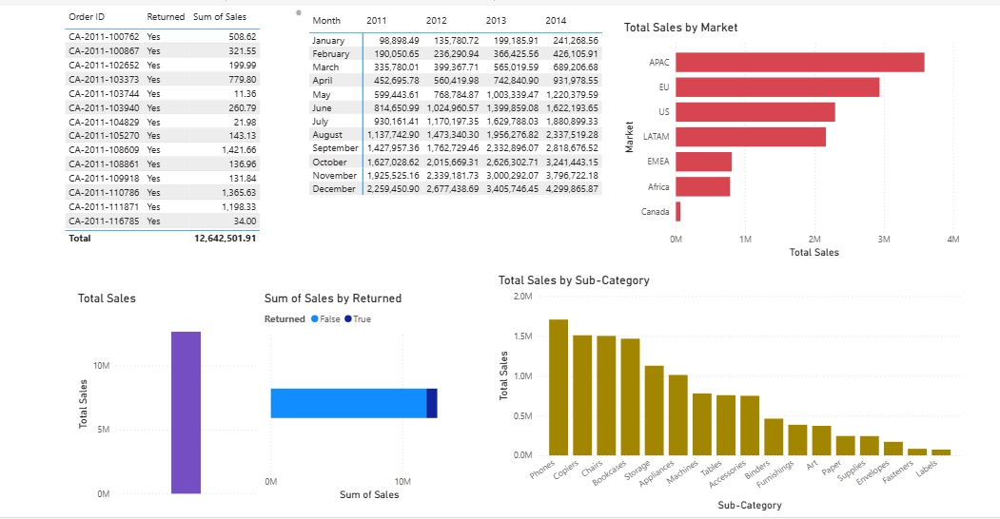
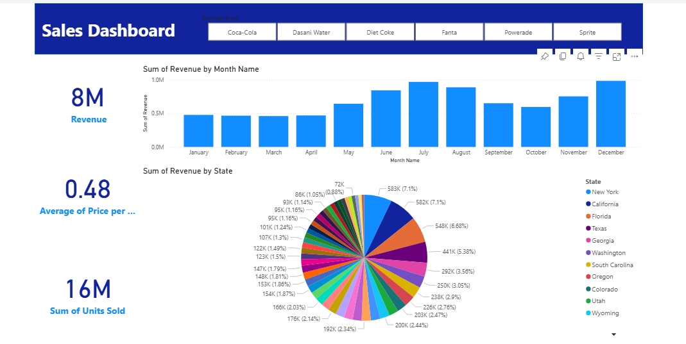
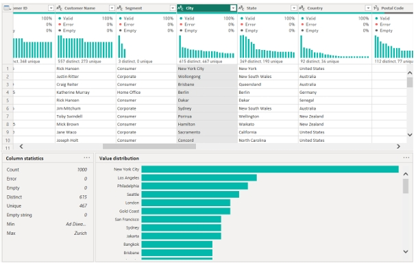

# 📊 Power BI Sales Dashboard

This project analyzes sales performance using Power BI. It includes category-wise sales, quantity sold, profit/loss by state, and customer segment analysis.

## 📷 Dashboard Screenshots

### 🔸 Overall Sales View

### 🔸 Regional & Profit Breakdown

### 🔸 Segment-wise Performance

### 🔸 Summary KPI Overview

